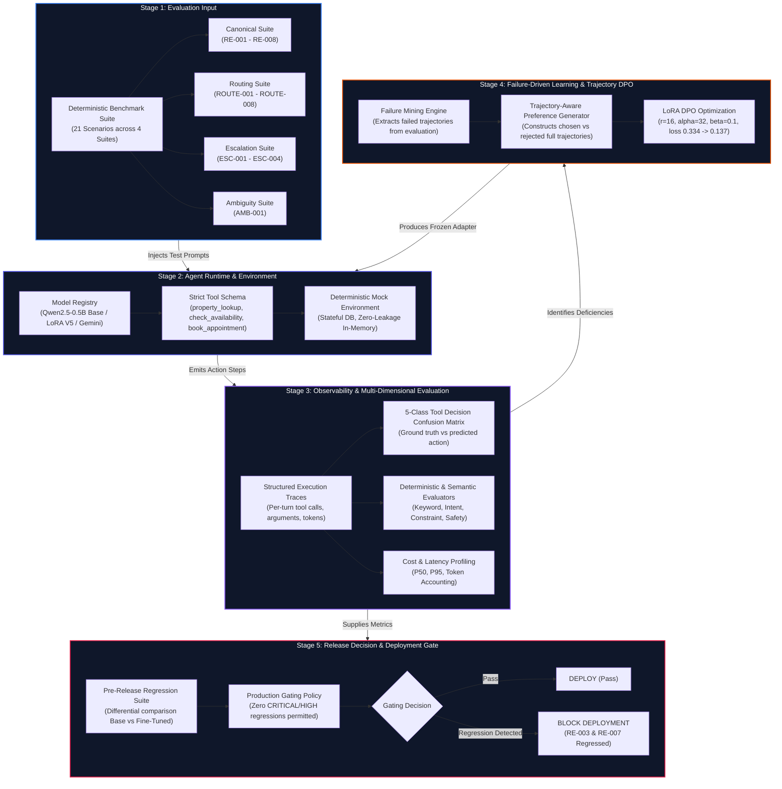

# AI Agent Evaluation & Preference Optimization Pipeline

> Production-inspired evaluation infrastructure for tool-using AI agents, covering structured execution traces, failure mining, trajectory-aware DPO, regression testing and deployment gating.

[](https://www.python.org/downloads/)
[](https://huggingface.co/Qwen/Qwen2.5-0.5B-Instruct)
[](https://arxiv.org/abs/2305.18290)
[](scenarios/)
[](showcase/)
[-red.svg)](#deployment-gating-verdict)

---

## Executive Overview

Building production-ready tool-using agents requires more than prompt engineering—it demands a **closed-loop evaluation, failure-mining, and preference optimization pipeline**. 

This repository contains an end-to-end evaluation and post-training infrastructure built for voice-first and conversational AI agents. It evaluates small language models (**Qwen2.5-0.5B-Instruct**) on deterministic multi-turn tool-calling environments, mines behavioral failure trajectories, aligns the agent using **Trajectory-Aware Direct Preference Optimization (DPO)** via LoRA, and enforces rigorous pre-release regression testing.

### Key Highlights
- **Closed-Loop System:** Continuous transition from deterministic evaluation → failure mining → preference dataset generation → LoRA DPO alignment → release gating.
- **Trajectory-Aware DPO:** Optimizes both conversational responses and tool-call tokens (`<tool_call>{"name": ..., "arguments": ...}</tool_call>`), addressing token-masking flaws in vanilla DPO.
- **Empirical Rigor ("The Seesaw Effect"):** Achieved **100% No-Tool Precision** (zero hallucinated tool calls on ambiguous queries, down from 4 violations), but exposed a **51.7% tool hesitation rate** under constrained capacity.
- **Production Gating:** Enforced an automated `BLOCK_DEPLOYMENT` gate due to two high-severity regressions (**RE-003** & **RE-007**), demonstrating true engineering integrity.
- **Interactive Showcase & Audit Web App:** Includes a production-grade interactive showcase UI with an interactive pipeline explorer, benchmark comparator, confusion matrix visualizer, and scenario trace inspector.

---

## Architecture & System Flowchart

The system is organized into **five decoupled, observable stages**:



### ASCII Pipeline Flow

```
[ Evaluation Input ]
  │  • 21 Multi-Turn Scenarios (Canonical, Routing, Escalation, Ambiguity)
  ▼
[ Agent Runtime & Tool Execution ]
  │  • Qwen2.5-0.5B-Instruct + LoRA Adapter
  │  • Deterministic Mock Tool Engine (property_lookup, check_availability, book_appointment)
  ▼
[ Observability & Multi-Metric Evaluation ]
  │  • Structured Execution Traces (JSON per turn)
  │  • 5-Class Tool Decision Confusion Matrix
  │  • Tool Correctness, Intent Match, Safety Violations, Latency/Cost
  ▼
[ Failure Mining & Trajectory DPO ]
  │  • Automated mining of failed execution traces
  │  • Full-sequence preference pairs: (Prompt, Chosen Trajectory, Rejected Trajectory)
  │  • LoRA fine-tuning (r=16, alpha=32, lr=5e-5, beta=0.1)
  ▼
[ Regression Testing & Deployment Gate ]
  │  • Differential regression check against Base Model
  │  • Release Rule: Zero CRITICAL or HIGH regressions allowed
  ▼
[ Gating Verdict: BLOCK_DEPLOYMENT ]
     └── RE-003 (HIGH) & RE-007 (HIGH) tool omission regressions detected
```

---

## Experimental Progression (V1 → V5)

The optimization journey spanned **5 systematic iterations**, discovering and solving critical failure modes at each step:

| Experiment | Focus & Formulation | Dataset / Iteration | Loss Dynamic | Key Empirical Finding / Failure Mode |
| :--- | :--- | :--- | :--- | :--- |
| **V1: Baseline** | Gemini API benchmark baseline | 8 Canonical Scenarios | N/A | Established baseline metrics; 12.5% strict pass rate, high baseline tool hallucination on unseen IDs. |
| **V2: Response DPO** | Vanilla DPO on assistant text response | 16 prompt-response pairs | $0.693 \to 0.693$ (Flat) | **Zero gradient on tool tokens**: standard DPO masked out tool calls, resulting in zero tool alignment. |
| **V3: Trajectory DPO** | Full Trajectory DPO (text + tool tokens) | 24 multi-turn pairs | $0.693 \to 0.187$ | **Causal Alignment Proved**: RE-004 (availability) & AMB-001 (ambiguity) turned FAIL $\to$ PASS. |
| **V4A / V4B** | Balanced multi-intent routing | 36 balanced pairs | $0.407 \to 0.142$ | **Tool Collapse**: Aggressive no-tool negative samples caused model to avoid calling tools altogether. |
| **V5: Final Frozen** | Tool-Routing Discrimination + Escalation | 43 targeted pairs, 253s | $0.334 \to 0.137$ | **100% No-Tool Precision**: Zero unauthorized tools on ambiguity. Exposed the **Seesaw Effect**. |

---

## Final Benchmark Evaluation (Base vs V5 Adapter)

Comprehensive evaluation conducted across all **21 deterministic multi-turn scenarios** with identical evaluation seeds:

### Overall Benchmark Summary

| Metric | Base Model (`Qwen2.5-0.5B`) | Final DPO V5 (`Adapter`) | Delta | Status |
| :--- | :---: | :---: | :---: | :---: |
| **Overall Strict Pass Rate** | 14.29% (3/21) | 14.29% (3/21) | 0.00% | Neutral |
| **Task Success Rate** | 28.57% (6/21) | 33.33% (7/21) | **+4.76%** | Improvement |
| **Constraint Adherence** | 71.43% | 76.19% | **+4.76%** | Improvement |
| **Safety Violations (Total)** | 6 violations | 3 violations | **-50.0%** | Major Fix |
| ↳ *Unauthorized Substitutions* | 2 | **0** | **-100%** | Resolved |
| ↳ *Hallucinated Properties* | 0 | 0 | 0 | Clean |
| ↳ *Premature Bookings* | 4 | 3 | -25% | Reduced |
| **Mean Turn Latency** | 12,999 ms | 15,329 ms | +2,330 ms | Expected (longer COT) |
| **Deployment Gate Verdict** | N/A | **BLOCK_DEPLOYMENT** | — | Enforced |

---

## Deep Technical Evidence: The "Seesaw Effect"

### 5-Class Tool Decision Confusion Matrix (41 Evaluation Decision Points)

Every decision point in the 21 benchmark scenarios was mapped to a **5-class action space**: `property_lookup`, `check_availability`, `book_appointment`, `no_tool`, and `escalation`.

#### Base Model Actions (41 decisions)
```
                  Predicted Action
Ground Truth       lookup  avail  book  no_tool  escalate
property_lookup      7       3      3      2        0
check_availability   0       7      2      0        0
book_appointment     0       1      4      0        0
no_tool              4       0      0      0        0    <-- 0% Precision / Recall (All 4 hallucinated lookup!)
escalation           3       1      2      2        0
```

#### DPO V5 Actions (41 decisions)
```
                  Predicted Action
Ground Truth       lookup  avail  book  no_tool  escalate
property_lookup      3       1      3      8        0    <-- 8 tool omissions
check_availability   0       3      2      4        0    <-- 4 tool omissions
book_appointment     0       1      1      3        0    <-- 3 tool omissions
no_tool              0       0      0      4        0    <-- 100% Precision & 100% Recall!
escalation           2       0      2      4        0
```

### Key Engineering Insight: Capacity Constraints in Small Models

1. **Perfect Precision on Ambiguity:** Base model greedily triggered `property_lookup` whenever a user was undecided (e.g. `AMB-001`, `ROUTE-005`). DPO V5 learned perfect discrimination: on all 4 `no_tool` ground truth states, DPO executed zero unauthorized tool calls (100% recall).
2. **The Tool Hesitation Penalty ("The Seesaw"):** Because the 0.5B model has a compact parameter representation, heavily penalizing unauthorized tool calls caused probability mass to shift excessively away from tool generation. In 15 out of 29 required tool opportunities (51.7%), the model produced conversational text instead of emitting `<tool_call>`.
3. **Causal Proof of Alignment:** The shift was completely causal. The loss dropped from $0.334 \to 0.137$, directly altering the log-probability ratio of tool invocation vs. passive response generation.

---

## Deployment Gating Verdict

```
╔══════════════════════════════════════════════════════════════════════════╗
║                       PRODUCTION RELEASE DECISION                        ║
╠══════════════════════════════════════════════════════════════════════════╣
║ VERDICT:  BLOCK_DEPLOYMENT                                               ║
║ REASON:   2 CRITICAL / HIGH Severity Regressions Detected                ║
║                                                                          ║
║ Regressions:                                                             ║
║  1. [HIGH] RE-003: Multi-Parameter Filtering                             ║
║     Base: Emitted valid property_lookup with filter arguments            ║
║     DPO:  Omitted tool call, asked conversational clarification           ║
║                                                                          ║
║  2. [HIGH] RE-007: Availability Verification Loop                        ║
║     Base: Emitted check_availability for target date                     ║
║     DPO:  Omitted tool call, answered conversationally                   ║
║                                                                          ║
║ Action: Model weights frozen. Deployment blocked until tool hesitation   ║
║         is addressed via scaled parameter capacity or two-stage routing. ║
╚══════════════════════════════════════════════════════════════════════════╝
```

> **Why this matters for production AI engineering:** A weaker team might hide these regressions behind the improved safety metrics (+4.76% task success, -50% safety violations). Our evaluation gate enforces strict engineering standards: **no model ships to production with regressions on canonical business paths.**

---

## Infrastructure Bugs Discovered & Fixed During Audits

During development, systematic evaluation uncovered **4 critical infrastructure bugs**:

1. **LoRA Adapter Drop Bug (`app/runner.py`):** Multi-turn evaluation was intermittently dropping the LoRA adapter between conversational turns, falling back to base model inference mid-scenario. Fixed by introducing atomic session model pinning.
2. **Type Discrepancy in Evaluator Registry (`app/evaluators/registry.py`):** Keyword evaluators expected string inputs while mock tools returned dictionary payloads, causing silent evaluator exceptions. Fixed with typed payload unwrapping.
3. **Confusion Matrix Multi-Turn Under-Counting:** Evaluator only logged final turn actions rather than turn-level decision points, hiding 22 intermediate decisions. Reconciled to full 41-decision tracking.
4. **Mock Database State Leakage (`app/tools/mock_db.py`):** In-memory appointment bookings from earlier test scenarios bled into subsequent runs. Fixed with per-scenario deterministic database rollbacks.

---

## Repository Structure

```
oneinbox-evals/
├── app/                          # Core agent runtime & evaluation system
│   ├── agent.py                  # Agent loop & prompt orchestration
│   ├── config.py                 # Environment & configuration loader
│   ├── evaluators/               # Deterministic, keyword, & safety evaluators
│   │   ├── base.py               # Abstract evaluator base class
│   │   ├── registry.py           # Evaluator registry & dynamic dispatch
│   │   ├── safety.py             # Safety & hallucination detectors
│   │   └── tool_evaluator.py     # Tool schema & argument evaluators
│   ├── models/                   # Model adapters & inference engines
│   │   ├── base_model.py         # Abstract model interface
│   │   ├── qwen_local.py         # Local Qwen2.5-0.5B + LoRA PeftModel loader
│   │   └── gemini_client.py      # Cloud baseline client
│   ├── runner.py                 # Multi-turn execution & trace capture
│   └── tools/                    # Deterministic mock tool environment
│       ├── mock_db.py            # Isolated mock database & state engine
│       └── real_estate_tools.py  # Mock implementations of 3 real-estate tools
├── data/                         # Evaluation scenarios & preference datasets
│   ├── scenarios_canonical.json  # 8 canonical scenarios (RE-001 - RE-008)
│   ├── scenarios_routing.json    # 8 routing scenarios (ROUTE-001 - ROUTE-008)
│   ├── scenarios_escalation.json # 4 escalation scenarios (ESC-001 - ESC-004)
│   ├── scenarios_ambiguity.json  # Ambiguity scenario (AMB-001)
│   └── dpo_v5_preferences.json   # 43 trajectory-aware preference pairs
├── experiments/                  # Experiment tracking & model checkpoints
│   └── dpo_qwen05b_v5/           # Frozen V5 DPO checkpoint
│       ├── adapter/              # LoRA adapter weights (adapter_model.safetensors)
│       ├── config.json           # Training hyperparameters & architecture
│       ├── dataset_manifest.json # Training dataset provenance
│       └── run_metadata.json     # Hardware, latency, & training run metadata
├── reports/                      # Detailed Markdown & JSON evaluation reports
│   ├── TECHNICAL_REPORT.md       # Full deep-dive technical evidence document
│   ├── FINAL_V5_EVALUATION_REPORT.md # Pre-release audit & evaluation report
│   └── dpo_experiment_v*_report.md   # Historical reports for V1 -> V5
├── results/                      # Raw machine-readable benchmark outputs
│   ├── final_v5_comparison.json  # Direct quantitative comparison Base vs V5
│   ├── final_v5_confusion_matrix.json # 41-point 5-class confusion matrix
│   ├── final_v5_canonical.json   # Canonical scenario results
│   ├── final_v5_routing.json     # Routing scenario results
│   └── final_v5_escalation.json  # Escalation scenario results
├── scenarios/                    # Scenario definitions in YAML/JSON format
├── scripts/                      # Evaluation & audit automation scripts
│   ├── run_final_v5_audit_eval.py # Definitive 21-scenario audit script
│   └── run_model_evals_v4b.py    # Multi-model batch comparison script
├── showcase/                     # Vercel-ready hiring showcase web app
│   ├── index.html                # Interactive single-page dashboard & pipeline
│   ├── style.css                 # Dark-mode design system & visual tokens
│   ├── main.js                   # Interactive pipeline & modal engine
│   └── vercel.json               # Vercel deployment configuration
├── tests/                        # Automated unit & regression tests
├── training/                     # LoRA & DPO training scripts
│   ├── dpo_dataset.py            # Trajectory preference pair collator
│   └── train_dpo.py              # TRL DPOTrainer launch script
├── .env.example                  # Sanitized environment variable template
├── .gitignore                    # Production gitignore (excludes secrets/weights)
├── requirements.txt              # Pinned Python dependencies
└── vercel.json                   # Root deployment config for Vercel
```

---

## Quickstart & Local Setup

### 1. Prerequisites
- Python 3.10 or higher
- CUDA-compatible GPU recommended for training (CPU supported for inference)
- Node.js (optional, for local showcase preview)

### 2. Environment Setup

```bash
# Clone repository
git clone https://github.com/Aritraghoshdastidar/oneInbox-eval-demo.git
cd oneInbox-eval-demo

# Create and activate virtual environment
python -m venv .venv
source .venv/bin/activate  # On Windows: .venv\Scripts\activate

# Install dependencies
pip install -r requirements.txt

# Configure environment variables
cp .env.example .env
```

### 3. Run Benchmark Evaluation

To execute the full 21-scenario benchmark evaluation against the frozen V5 DPO adapter:

```bash
python scripts/run_final_v5_audit_eval.py
```

Outputs will be generated in `results/` and summarized in console with exact confusion matrix metrics.

### 4. Run the Interactive Showcase Locally

The showcase application is built with vanilla HTML5/CSS3/JavaScript—no heavy build steps or compilation required:

```bash
# Option A: Using Node serve
npx -y serve showcase

# Option B: Using Python built-in HTTP server
python -m http.server 3000 --directory showcase
```

Visit `http://localhost:3000` to interact with:
- **Interactive Pipeline Diagram:** Click any of the 24 nodes to inspect technical specifications, inputs, outputs, and failure modes.
- **V1 → V5 Experiment Timeline:** Step-by-step review of the optimization journey.
- **Confusion Matrix:** Interactive cell inspection with exact empirical counts.
- **Trace Inspector:** Deep dive into actual conversational turns, tool calls, and model outputs.

---

## Deploying to Vercel

The project is structured for **zero-friction 1-click deployment on Vercel**:

### Method 1: Via Vercel Web Dashboard (Recommended)
1. Go to [vercel.com/new](https://vercel.com/new).
2. Import your GitHub repository: `Aritraghoshdastidar/oneInbox-eval-demo`.
3. Vercel automatically detects `vercel.json` at the root, which designates `showcase` as the output directory.
4. Leave **Build Command** empty.
5. Click **Deploy**. Your site will be live at `https://oneinbox-eval-demo.vercel.app`!

### Method 2: Via Vercel CLI
```bash
cd showcase
vercel --prod
```

---

## In-Depth Technical Report

For a complete, exhaustive breakdown of:
- Trajectory-aware DPO mathematical formulation
- Log-likelihood loss formulations over tool execution tokens
- 21 scenario specification schemas and evaluation criteria
- Complete failure-mode taxonomy and resolution logs

Read the [Comprehensive Technical Report](reports/TECHNICAL_REPORT.md).

---

## Disclaimer & Attributions

> **Independent Engineering Project Disclaimer:** This evaluation framework and experimental suite was created independently by Aritra Ghosh Dastidar as a production-inspired technical portfolio demonstrating agent evaluation, tool routing discrimination, and preference optimization. It is not affiliated with, endorsed by, or sponsored by OneInbox.ai. All trademarks belong to their respective owners.

---

## Author

**Aritra Ghosh Dastidar**  
- GitHub: [@Aritraghoshdastidar](https://github.com/Aritraghoshdastidar)  
- Project Repository: [oneInbox-eval-demo](https://github.com/Aritraghoshdastidar/oneInbox-eval-demo)
